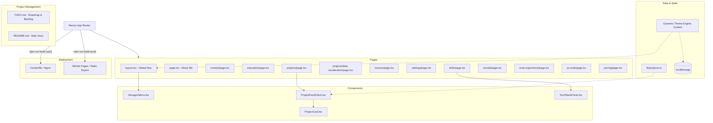

# Resume Website Project Knowledge Graph

This document provides a high-level overview of the project architecture using a Mermaid.js diagram and component breakdown.

## Architecture Diagram

## Component Breakdown
- **Frontend Framework**: Next.js 16 (App Router), React 19.
- **Styling & Animations**: Tailwind CSS 4, framer-motion, Recharts (Data Visualization).
- **Layout Approach**: Bento Box layout (CSS Grid), responsive, glassmorphic UI.
- **State Management**: React Context (Theme Engine) and `localStorage`.
- **Infrastructure**: Hosted on GitHub Pages via static export. Local development supported by Docker + Nginx.

## Key Design Principles
- Cyberpunk aesthetic, neon accents, dark mode base.
- HTML5 Canvas for interactive backgrounds (particles/grids).
- Fluid route transitions via `AnimatePresence`.
